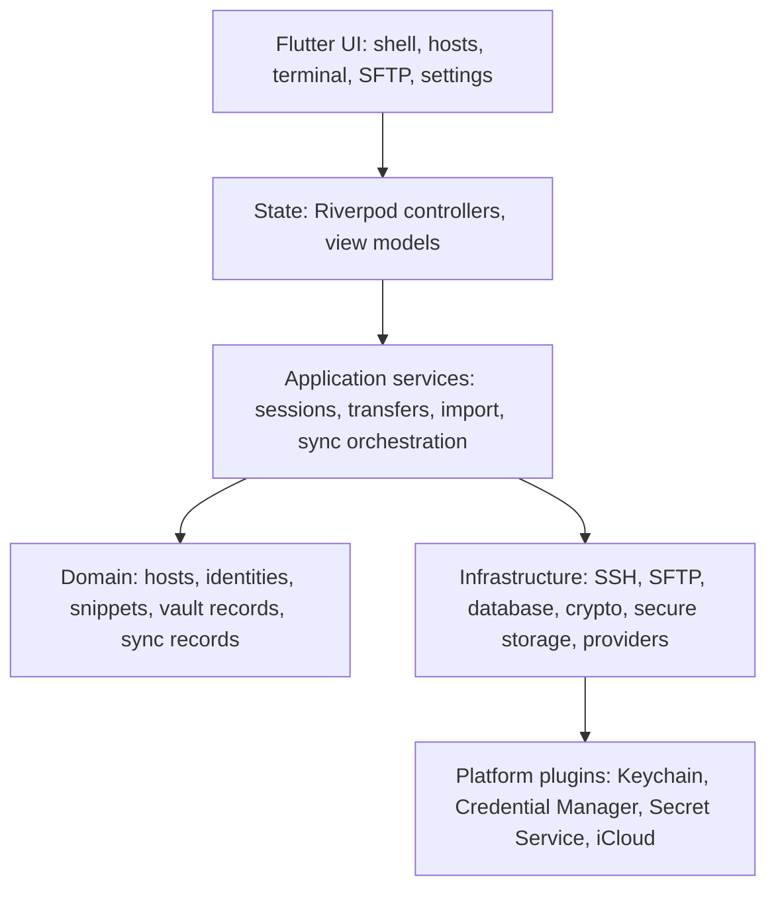
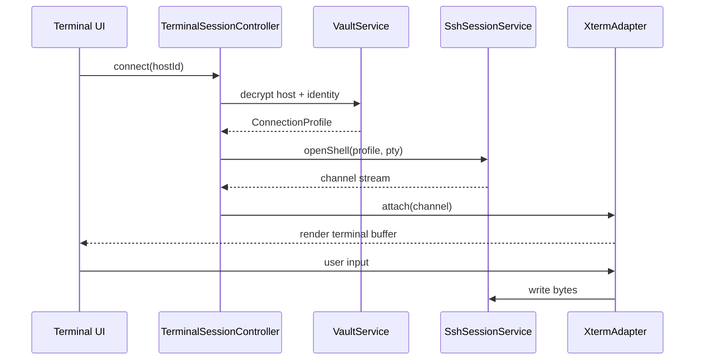
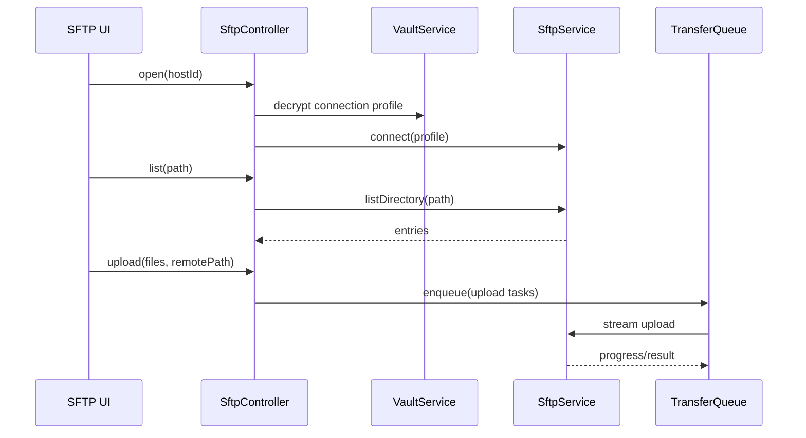
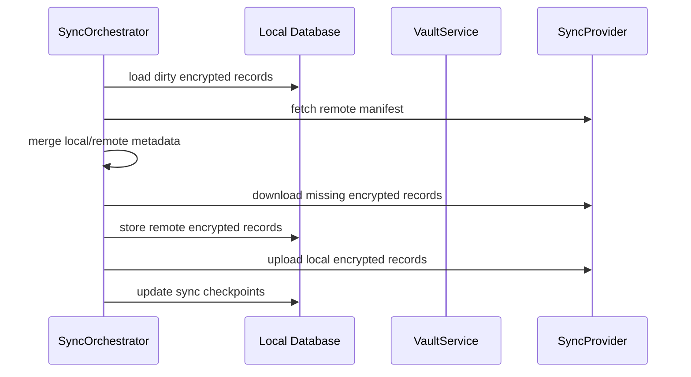

# Architecture

## Architectural Principles

- Desktop-first UI, portable core.
- Offline-first data model.
- Encrypt before persistence and before sync.
- Keep SSH/SFTP transport independent from widgets.
- Keep sync provider independent from vault record format.
- Treat OS credential storage as a key protection layer, not as the database.
- Prefer testable Dart services with thin native plugins only where platform capability is required.

## High-Level Layers



## Package Layout

Proposed Flutter package structure:

```text
lib/
  main.dart
  app/
    serlink_app.dart
    app_bootstrap.dart
    app_router.dart
    app_theme.dart
  core/
    async/
    errors/
    logging/
    platform/
    result/
    time/
  features/
    hosts/
      domain/
      application/
      data/
      presentation/
    identities/
      domain/
      application/
      data/
      presentation/
    terminal/
      domain/
      application/
      infrastructure/
      presentation/
    sftp/
      domain/
      application/
      infrastructure/
      presentation/
    sync/
      domain/
      application/
      infrastructure/
      presentation/
    vault/
      domain/
      application/
      infrastructure/
    settings/
      domain/
      application/
      data/
      presentation/
    snippets/
      domain/
      application/
      data/
      presentation/
  database/
    app_database.dart
    migrations/
    tables/
  platform/
    secure_storage/
    ssh_agent/
    icloud/
    file_system/
  design_system/
    tokens/
    components/
    terminal_themes/
test/
integration_test/
tool/
```

## Module Responsibilities

### App Shell

- Window frame and platform menu integration.
- Routing.
- Global command palette.
- Keyboard shortcut registration.
- Global sync/session/transfer status surfaces.
- Modal orchestration for security confirmations, fingerprint verification, import/export warnings, and destructive actions.

### Hosts

- Host CRUD.
- Groups, tags, folders, pinned/recent records.
- Host import/export preview.
- Host search indexes.
- Host-specific terminal/SFTP defaults.

### Identities

- SSH private key import.
- Password records.
- Passphrase records.
- Device-local vs portable credential classification.
- Identity reuse across hosts.

### Vault

- Encryption/decryption of records.
- Vault unlock/lock lifecycle.
- Key derivation and key wrapping.
- Plaintext cache policy.
- Encrypted backup import/export.

### Terminal

- Terminal session lifecycle.
- PTY request, channel read/write, resize.
- xterm adapter and themes.
- Terminal tab content hosted inside the shared workspace tab container.
- Copy/paste, search, scrollback, zmodem hooks.

### SFTP

- SFTP connection lifecycle.
- Directory browsing.
- File operations.
- Transfer queue.
- Conflict handling.
- Permission editor.
- SFTP tab content hosted inside the shared workspace tab container.
- Initial SFTP UI is list/table-first; richer Explorer-style modes are later roadmap work.

### Workspace Tabs

- Own the shared tab container for terminal and SFTP tabs.
- Support multiple simultaneous connections to different hosts.
- Support terminal and SFTP tabs mixed in one tab strip.
- Preserve per-tab lifecycle state, title, host id, connection kind, dirty/transfer state, and recoverable failure state.
- Avoid redundant per-tab indicators; show only concise icons/badges for actionable states such as connecting, disconnected, failed, or transfer in progress.

### Sync

- Sync provider abstraction.
- Encrypted record manifest.
- Conflict detection and resolution.
- Automatic background sync orchestration.
- Provider credential management.
- Sync settings and conflict resolver entry points are presented inside the Settings feature; sync remains an engineering module, not a primary navigation page.

### Settings

- App preferences.
- Terminal preferences.
- Security preferences.
- Sync provider preferences.
- Keyboard shortcuts.
- Data import/export preferences and actions.

### Data Exchange

- Import OpenSSH config, SSH private keys, known hosts, and encrypted vault backups.
- Export encrypted vault backups, selected host metadata, public key material, and diagnostic bundles.
- Require modal security confirmation before exporting any sensitive or potentially identifying data.

## Runtime Data Flow

### SSH Terminal Connection



### SFTP Browse And Transfer



### Sync



## Data Storage Model

Use a dual representation:

1. Canonical encrypted record payloads. These are the source of truth and are safe to sync.
2. Local derived indexes. These are decrypted/searchable values needed for fast UI and are stored encrypted or rebuilt after unlock, depending on sensitivity.

Recommended local tables:

- `vault_records`: encrypted payloads, schema version, record type, record id, revision, tombstone flag.
- `host_index`: decrypted after unlock or encrypted-at-rest display fields for host list.
- `identity_index`: non-secret display metadata.
- `known_host_keys`: host key fingerprints and trust state, encrypted if synced.
- `sync_accounts`: provider metadata and encrypted provider credential references.
- `sync_checkpoints`: per-provider local state.
- `terminal_profiles`: theme/settings records.
- `transfer_tasks`: durable transfer state; paths may be sensitive and should be encrypted or redacted based on setting.

## Session Model

Session types:

- `TerminalSession`: shell channel attached to terminal emulator.
- `SftpSession`: SFTP subsystem session.
- `ForwardSession`: local/remote/dynamic forwarding lifecycle.
- `ZmodemTransferSession`: terminal stream file transfer.

Each session has:

- Stable session id.
- Host id.
- Connection profile snapshot id.
- State machine.
- Creation time.
- Last activity time.
- Error state.
- Optional parent session for SFTP opened from terminal.
- Workspace tabs reference a session and a content kind: terminal or SFTP.

Session states:

- `idle`
- `resolvingProfile`
- `connecting`
- `verifyingHostKey`
- `authenticating`
- `openingChannel`
- `connected`
- `reconnecting`
- `disconnecting`
- `disconnected`
- `failed`

Unexpected disconnect handling:

- Terminal tabs move to `disconnected` or `failed` without closing the tab.
- SFTP tabs keep the last navigated path and show a reconnect action.
- Reconnect starts a new connection inside the current tab.
- Reconnect re-resolves the host profile and credentials from the vault; if the vault is locked, the user must unlock before reconnecting.
- A failed tab must not crash or invalidate other active tabs.
- Full app exit discards workspace tabs and live session metadata; no previous terminal/SFTP tabs are restored on next launch.
- Vault lock does not close, pause, or otherwise affect already-established SSH/SFTP connections.

## Connection Profile Resolution

Host records do not directly expose secrets. To connect:

1. Load host record.
2. Load linked identity records.
3. Ask vault to decrypt required secret material.
4. Ask OS secret store for device-local key material if selected.
5. Resolve SSH config inheritance and jump host chain.
6. Produce a short-lived `ConnectionProfileSnapshot`.
7. Use snapshot to connect.
8. Dispose sensitive material after connection setup where possible.

## Sync Record Model

Each syncable item is represented as:

```text
SyncRecordEnvelope
  recordId: uuid
  recordType: host | identity | group | snippet | terminalProfile | settings | knownHost
  schemaVersion: int
  vaultId: uuid
  revision: string
  updatedAt: hybrid logical timestamp
  tombstone: bool
  aad: canonical metadata included as AEAD associated data
  ciphertext: bytes
  nonce: bytes
```

Provider object layout:

```text
/serlink-vault/
  manifest.json.enc
  records/
    host/
      <recordId>.<revision>.rec
    identity/
      <recordId>.<revision>.rec
  tombstones/
  locks/
  devices/
```

The provider never receives plaintext hostnames, usernames, paths, notes, or credential data.

## Native Plugin Boundaries

### Required Eventually

- macOS Keychain capabilities and sync flags.
- Windows Credential Manager or DPAPI capabilities.
- Linux Secret Service capabilities.
- iCloud provider.
- SSH agent integration if pure Dart cannot reach required platform sockets/pipes consistently.

### Optional

- Native menu integration.
- Window tabs on macOS.
- Drag/drop enhancements.
- Native notifications for transfer completion.

## Error Handling

Use typed failures:

- `VaultFailure`
- `SecretStoreFailure`
- `SshConnectionFailure`
- `HostKeyFailure`
- `AuthenticationFailure`
- `SftpFailure`
- `TransferFailure`
- `SyncFailure`
- `ImportFailure`
- `ExportFailure`
- `PlatformCapabilityFailure`

Every failure should include:

- Stable code.
- User-safe message.
- Developer diagnostic message with redaction.
- Retryability.
- Suggested action.

## Logging

Logging rules:

- Never log passwords, private keys, passphrases, decrypted hostnames, usernames, commands, remote paths, or file names unless explicit debug mode is enabled with clear warning.
- Use event categories rather than raw values.
- Include correlation IDs for sessions, transfers, and sync runs.
- Redact by default.

## Configuration

Configuration domains:

- App UI settings.
- Terminal defaults.
- Host-specific overrides.
- Sync settings.
- Security settings.
- Transfer settings.
- Keyboard shortcuts.
- Debug/release runtime diagnostics.

Settings resolution order:

1. Hard-coded safe defaults.
2. App-level settings.
3. Group-level settings.
4. Host-level settings.
5. Session temporary overrides.

## Future Mobile Architecture Fit

Mobile-specific shells can reuse:

- `features/hosts/domain`
- `features/identities/domain`
- `features/vault`
- `features/sync`
- `features/terminal/application`
- `features/sftp/application`

Desktop-only UI should remain in presentation packages with adaptive breakpoints and platform-specific command registration.
