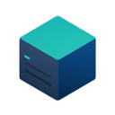

<p align="center">
  
</p>

<h1 align="center">Serlink</h1>

<p align="center">
  <strong>A private SSH terminal and SFTP workspace for remote machines.</strong>
</p>

<p align="center">
  <a href="LICENSE"></a>
  
  
</p>

Serlink brings SSH sessions, SFTP transfers, host profiles, command snippets,
and encrypted sync into one focused Flutter app. It is built for people who
move between servers often and want their connection data to stay private.

> Serlink is in active development. The desktop core is substantial, iOS support
> and Apple sync/release paths are being hardened, and public production builds
> are not release-ready yet.

## Highlights

| Area | What Serlink already does |
| --- | --- |
| Terminal workspace | SSH tabs, local terminal tabs, split panes, reconnect-in-place, buffer search, paste guard, startup commands, ZMODEM, and local/remote/SOCKS port forwarding. |
| SFTP and transfers | Remote directory browsing, file actions, bounded text preview/edit, upload/download queues, progress details, pause/resume/retry, and conflict handling. |
| Hosts and credentials | Host profiles, password identities, private keys, OpenSSH certificates, known-host verification, jump hosts, tags, and OpenSSH config import/export. |
| Private vault | Encrypted Drift/SQLite storage, recovery keys, encrypted backups, secure-storage secrets, Face ID unlock where available, and background privacy controls. |
| Encrypted sync | WebDAV sync, private CloudKit sync on Apple platforms, device records, conflict review, tombstones, remote repair, TLS diagnostics, and certificate pinning. |
| Daily workflow | Command snippets, transfer history, redacted diagnostics, and app localization for English, Simplified Chinese, and Japanese. |

## Platform Snapshot

| Platform | Status |
| --- | --- |
| macOS | Primary desktop target with App Store, TestFlight, and direct distribution tooling in progress. |
| iOS | Active mobile foundation with CloudKit sync bridge, touch workspace, document gateway, and device validation work underway. |
| Windows | Desktop Flutter project and shared desktop core are present; installer and real-machine QA are still pending. |
| Linux | Desktop Flutter project and shared desktop core are present; packaging and distro QA are still pending. |
| Android | Not an active release target right now. |

## Development

Requirements:

- Flutter SDK compatible with Dart `^3.12.0`
- Desktop Flutter toolchain for the target OS
- Xcode command line tools for Apple platforms
- Visual Studio C++ desktop workload for Windows
- GTK/clang tooling normally required by Flutter desktop on Linux

Install dependencies:

```sh
flutter pub get
```

Run the app:

```sh
flutter run -d macos
flutter run -d windows
flutter run -d linux
```

Check the project:

```sh
flutter analyze
flutter test -r expanded
```

Release helpers and platform runbooks live in `docs/`:

- [Development release commands](docs/development_release_commands.md)
- [iOS release](docs/ios_release.md)
- [macOS release](docs/macos_release.md)
- [CloudKit production release](docs/cloudkit_production_release.md)
- [macOS distribution](docs/macos_distribution.md)

## Repository Map

```text
lib/
  app/          app shell, dependency wiring, router, and theme
  core/         shared ids, failures, runtime, security, and logging
  database/     Drift database and recovery helpers
  design_system/Serlink UI primitives and tokens
  features/     vault, hosts, identities, ssh, terminal, sftp, sync, transfers
  platform/     OS integrations such as secure storage and document gateways

test/           unit, widget, smoke, platform, sync, and release-gate tests
docs/           release, signing, CloudKit, distribution, and schema notes
third_party/    vendored dependencies with local patches
```

## Security Notes

- Host data, identities, snippets, transfer history, sync settings, and recovery
  data are designed to live in encrypted vault records.
- WebDAV and CloudKit sync store encrypted manifests and encrypted objects, not
  plaintext host data.
- Diagnostic exports are redacted and exclude terminal output, commands, hosts,
  usernames, paths, credentials, and private keys.
- Vault lock prevents new profile resolution but does not forcibly terminate
  already-established SSH or SFTP sessions.

## License and Brand

Serlink source code is licensed under the GNU Affero General Public License
version 3 or any later version. See [LICENSE](LICENSE).

The Serlink name, logos, icons, app store assets, screenshots, and related
branding materials are not licensed under the AGPL. See
[TRADEMARKS.md](TRADEMARKS.md) for the brand and trademark policy.

This repository vendors a patched copy of `xterm.dart` 4.0.0 under
`third_party/xterm`, which remains under the MIT License. See [NOTICE](NOTICE)
and [third_party/xterm/LICENSE](third_party/xterm/LICENSE).
